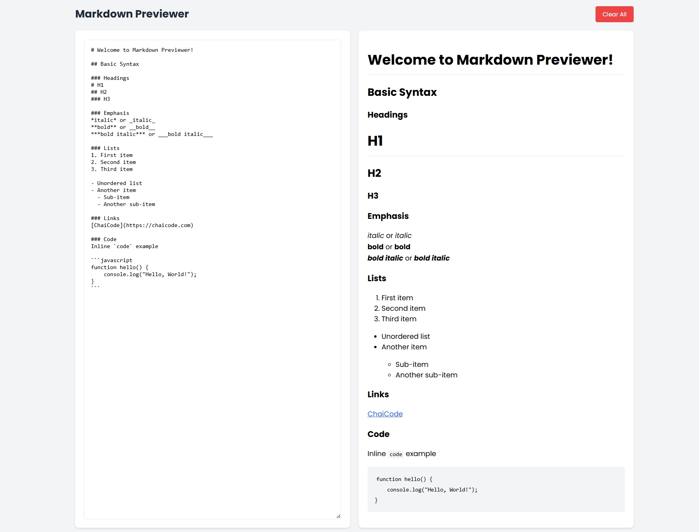

# Markdown Editor

A dynamic and user-friendly markdown editor that generates markdown for text input by the user.

## Table of Contents

- [Markdown Editor](#markdown-editor)
  - [Table of Contents](#table-of-contents)
  - [Deployment](#deployment)
  - [Features](#features)
  - [Technologies Used](#technologies-used)
  - [Installation](#installation)
  - [Preview](#preview)
  - [Acknowledgement](#acknowledgement)

## Deployment

- **Live link**: https://

## Features

- **Real-time Preview**: Instantly see the rendered markdown output.
- **Syntax Highlighting**: Provides clear differentiation between markdown syntax and content.
- **Live Editing**: Update markdown content dynamically without reloading.

## Technologies Used

- **HTML5**: For the structure of the project.
- **CSS3**: For styling and responsive design.
- **JavaScript**: For interactive elements.
- **Marked.js and Highlight.js**: For core functionality.

## Installation

1. Clone the repository:
   ```bash
   git clone https://github.com/Depkstha/markdowneditor.git
   ```

2. Navigate into the project directory:
   ```bash
   cd markdowneditor
   ```

3. Open `index.html` in your web browser to view the project.

## Preview
This is what it looks like



## Acknowledgement
This project is part of an assignment from Cohort on Masterji. Special thanks to Hitesh sir, Piyush sir, and the entire team for their guidance and support. Excited to be part of this amazing learning journey!
